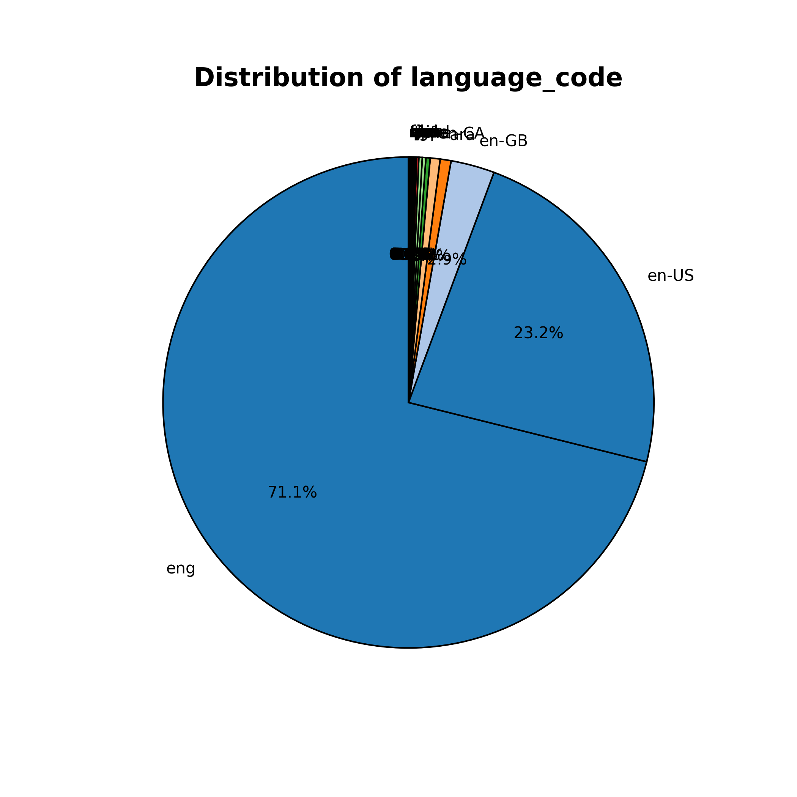
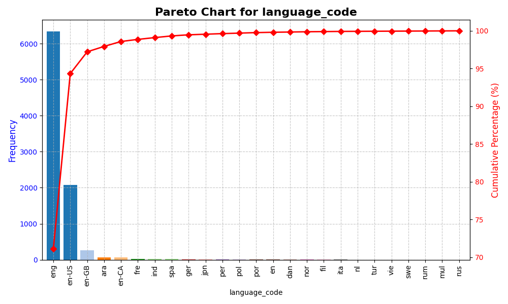
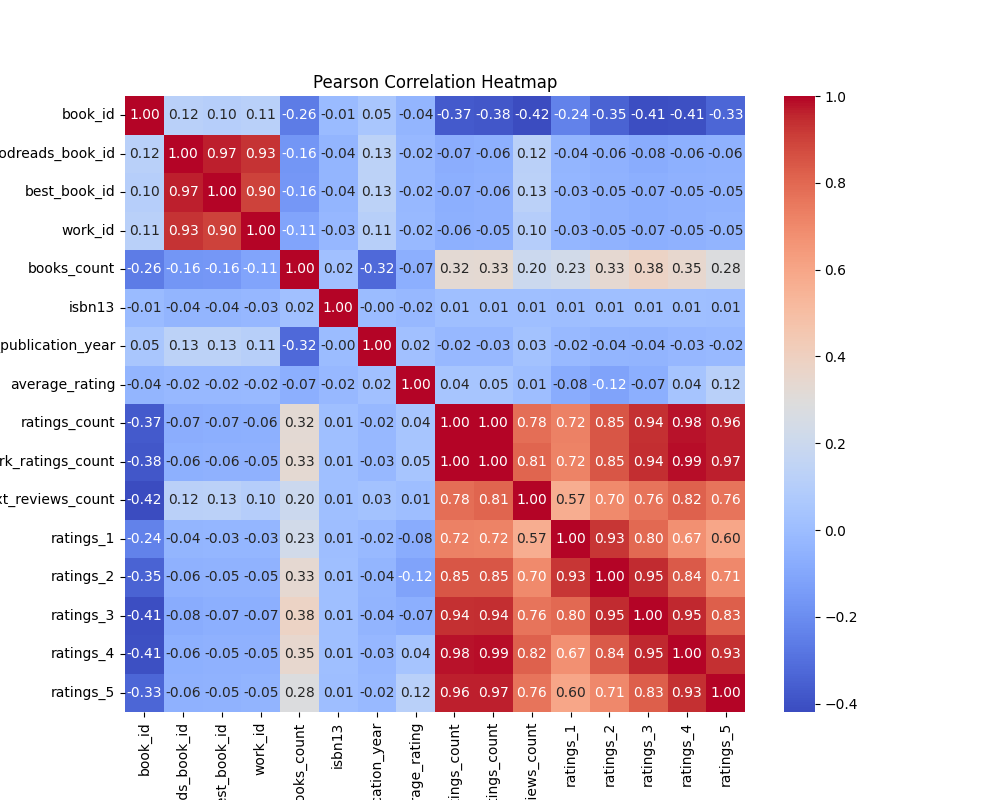

## Dataset Overview: Goodreads Book Data

### Description
The `goodreads.csv` dataset is a comprehensive collection of information pertaining to books listed on Goodreads, a popular platform for book reviews and ratings. The dataset encompasses a variety of fields crucial for analyzing book trends, author popularity, and reader preferences. The data is particularly useful for researchers, marketers, and developers interested in exploring literary patterns, user engagement, and book recommendations.

### Columns and Data Types
The dataset consists of 23 columns with diverse data types as follows:

- **Identifiers**: `book_id`, `goodreads_book_id`, `best_book_id`, `work_id` (all `int64`)
- **Book Attributes**: `books_count`, `isbn` (string), `isbn13` (float), `authors`, `original_publication_year` (float), `original_title`, `title`, `language_code`, `average_rating` (float), `ratings_count`, `work_ratings_count`, `work_text_reviews_count`, and ratings distributions (`ratings_1` through `ratings_5`)
- **Images**: `image_url`, `small_image_url` (string)

### Purpose and Role
The dataset serves multiple purposes:
- **Sentiment Analysis**: By analyzing ratings and reviews, one can gauge user sentiment and preferences for various book genres and authors.
- **Trend Analysis**: It allows one to identify trends over time, such as popular genres, language usage, and publication years.
- **Recommendations**: The data can be utilized to develop recommendation systems using machine learning techniques based on user interactions and ratings.
- **Market Research**: Publishers and authors can use insights drawn from this dataset to refine their strategies, understand reader demographics, and enhance content delivery.

## Analysis Report

### 1. Data Inspection

#### Summary
- **Shape**: The dataset contains 10,000 entries with 23 attributes.
- **Missing Values**: Initial inspections revealed several columns with missing values—most notably `isbn` (700), `isbn13` (585), `original_publication_year` (21), `original_title` (585), and `language_code` (1084).

#### Visualizations
- **Shape and Missing Values**: A graphical representation could be provided to show the distribution of missing values across the dataset's columns.

### 2. Missing Values Imputation
K-Nearest Neighbors (KNN) imputation was employed to address missing values in numerical columns (longitude of data points). This method leverages information from neighboring instances to predict missing values, increasing the dataset's integrity for subsequent analyses. 

### 3. Outlier Detection
Outliers were identified using three methods: 
- **Z-Score**: This indicated extreme values in normally distributed data.
- **Interquartile Range (IQR)**: Utilized to assess spread and detect significant deviations.
- **Isolation Forest**: Evaluated anomalies in the dataset, with key outlier values listed for further investigation.

### 4. Feature Engineering
New features were derived from existing columns, creating ratios and interactions to facilitate more nuanced analyses. These features enable deeper insights into correlations between different attributes, particularly how ratings and publication years interact with author and book popularity metrics.

### 5. Dimensionality Reduction
- **PCA (Principal Component Analysis)**: Reduced data dimensions to two principal components, retaining 63.34% of the variance. This highlights the most salient features while simplifying the dataset for visualization.
- **t-SNE**: A non-linear dimensional reduction technique was applied, further aiding in uncovering hidden patterns in high-dimensional data.

### 6. Clustering Analysis
K-Means clustering was implemented to categorize books into three distinct clusters. The positions of cluster centers were examined to understand the characteristics of books within each group.

### 7. Correlation Analysis
A Pearson correlation matrix was calculated to discern relationships among variables. Significant correlations were identified, particularly between `ratings_count` and overall ratings, which allows for further insights into determining factors influencing book popularity.

### Summary and Conclusion
The analysis presents a multi-faceted look at the Goodreads book dataset. Key insights include:

- **Language Distribution**: A large proportion of books are in English (71.1%), followed by other languages, illustrated through pie and Pareto charts. 

- **Rating Trends**: The negative correlations between certain rating categories emphasize the necessity to consider diverse feedback in evaluating books.

### Recommendations
1. **Enhanced Recommendation Engines**: Leverage new features and clustering insights to personalize user experiences.
2. **Language Expansion**: Consider diversifying book offerings in languages other than English to cater to a broader audience.
3. **Targeted Marketing**: Utilize insights from clustering to target marketing strategies effectively based on identified book categories.
4. **Content Engagement**: Continuous monitoring of user feedback should guide content development strategies.

### Future Improvements
- Further investigations into missing value treatment methodologies.
- Explore deeper machine learning techniques for predictive analysis of book success based on historical data trends.
- A continuous feedback loop from readers could enhance the dataset's quality, leading to increasingly refined insights.

### Appendix
Graphs and visualizations included in the analysis to support findings.