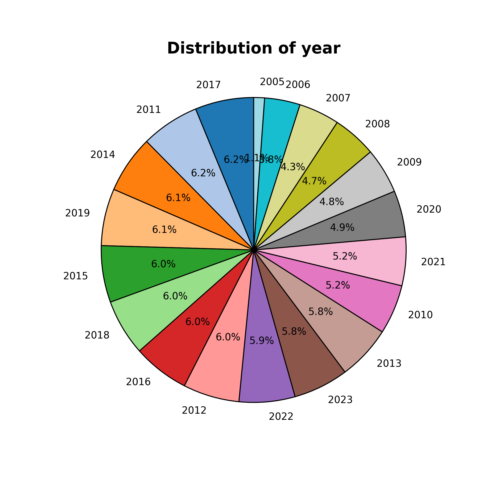
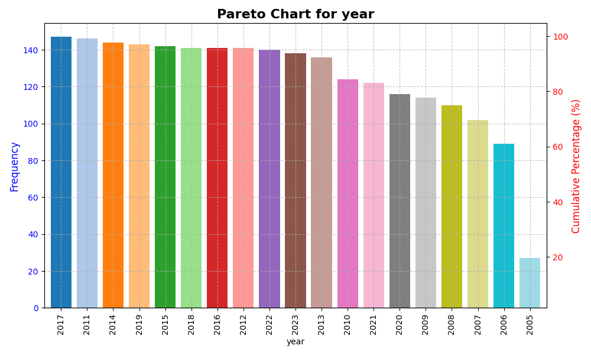
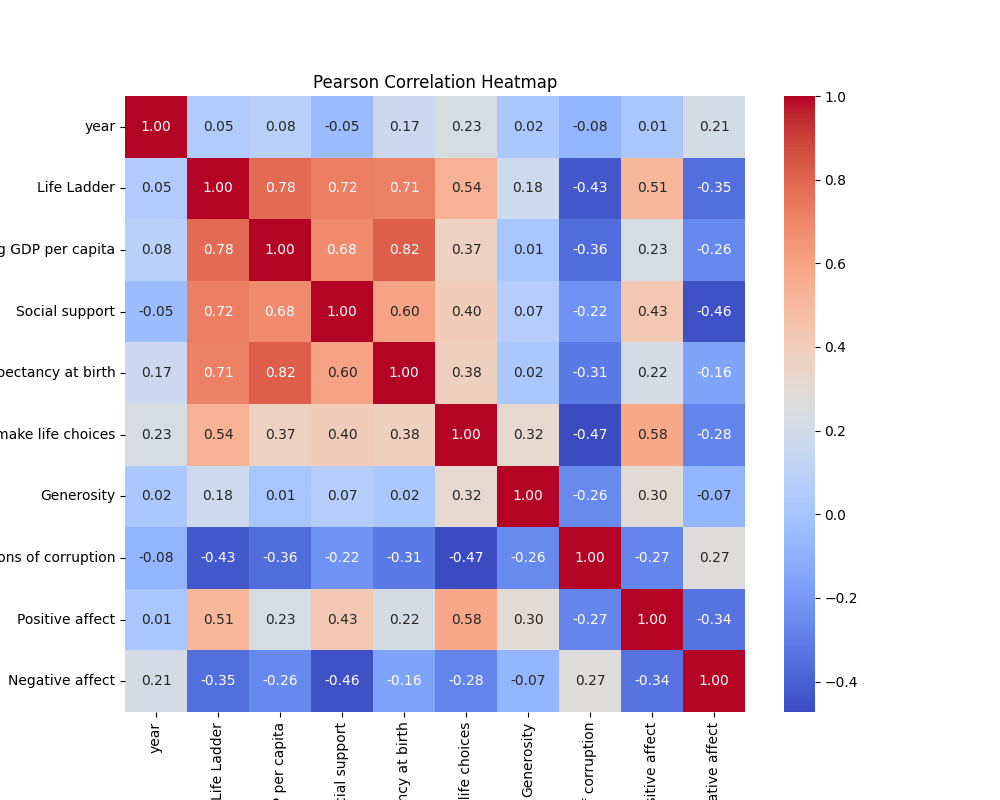

# Detailed Analysis and Visualization Report on Happiness Dataset

## Introduction

The dataset titled **happiness.csv** focuses on various factors contributing to the happiness and well-being of individuals across different countries and years. The key variables include life satisfaction indicators like the Life Ladder, economic factors such as GDP per capita, social support metrics, health metrics like life expectancy, and perceptions of corruption. This dataset serves to analyze and understand the complex interplay between economic, social, and psychological factors influencing overall happiness. It is particularly relevant for policymakers, researchers, and organizations aiming to improve quality of life and happiness levels on a global scale.

## Dataset Overview

### Structure of the Dataset

- **Rows:** 2363 (representing different country-year combinations)
- **Columns:** 11, which include:
  - **Country name**: Name of the country (string)
  - **year**: Year of the data point (integer)
  - **Life Ladder**: Happiness score (float)
  - **Log GDP per capita**: Economic measure (float)
  - **Social support**: Social well-being indicator (float)
  - **Healthy life expectancy at birth**: Health metric (float)
  - **Freedom to make life choices**: Personal freedom score (float)
  - **Generosity**: Indicator of giving (float)
  - **Perceptions of corruption**: Corruption perception (float)
  - **Positive affect**: Measure of positive emotions (float)
  - **Negative affect**: Measure of negative emotions (float)

### Data Quality Assessment

- **Missing Values**: The dataset contains several missing values, particularly in `Generosity` (81 missing entries) and `Perceptions of corruption` (125 missing entries).
- **Data Types**: The columns' data types are consistent and appropriate for analysis, with numeric types for analysis and categorical types for country names.

## Advanced Data Analysis

### Data Inspection

Initial exploration revealed the dimensions and potential issues in the dataset. The missing values were imputed using **KNN imputation**, which is a common method that utilizes the average of the nearest neighbors to replace nulls, ensuring that the imputation is based on the relationships between attributes.

### Outlier Detection

Outliers were identified using Z-Score and IQR methods, as well as the Isolation Forest algorithm. This is critical in ensuring that extreme values do not skew the analysis:

- **Key Outliers Detected**:
  - Life Ladder: 2
  - Social Support: 48
  - Perception of Corruption: 167

This points towards the need for potential data cleansing or careful consideration of these extremes in further analysis.

### Feature Engineering

Interaction features were created, enabling deeper analysis:

- Examples include `year_div_Life Ladder` and `Life Ladder_div_year`, which help evaluate relationships dynamically over time.
- This step enhances the dataset's richness by allowing for complex relationships between different happiness determinants.

### Dimensionality Reduction (PCA)

Using **Principal Component Analysis (PCA)**, we reduced the dataset to two principal components which explained roughly 57% of the variance:

- **Component 1 (PCA1)**: Focused on overall happiness indicators.
- **Component 2 (PCA2)**: More reflective of economic and social factors.

This reduction gives a more digestible overview of key metrics affecting happiness.

### Clustering (KMeans)

The **KMeans clustering** algorithm was implemented with an optimal cluster count of 3. This segmentation helps visualize groupings of countries based on happiness factors. 

- **Cluster Centers**:
  1. High happiness, high GDP, low corruption.
  2. Moderate GDP, moderate happiness.
  3. Low happiness, low GDP, high corruption.

Clusters indicate potential target areas for intervention by policymakers.

### Correlation Analysis

The **Pearson correlation matrix** revealed significant relationships among different variables:

- `Log GDP per capita` strongly correlates with `Life Ladder` (0.78).
- `Perceptions of corruption` shows negative correlations with most happiness indicators, particularly `Life Ladder` (-0.43).

This highlights critical areas to address for enhancing national happiness.

## Visualizations

### Year Distribution

This pie chart visualizes the distribution of data across years, helping identify trends over time.

### Pareto Chart

The Pareto chart showcases the frequency and cumulative percentage of each year, illuminating periods with the most data and possible shifts in happiness trends.

### Correlation Heatmap

The heatmap illustrates the correlation coefficients between the variables, allowing for quick visual identification of relationships.

## Summary and Conclusion

### Key Findings

1. **Strong Indicators of Happiness**: Economic factors like GDP significantly impact happiness metrics. Countries with higher GDP tend to report higher life satisfaction.
2. **Social Dynamics**: Social support and individual freedoms also play crucial roles in determining happiness levels, emphasizing the importance of social infrastructure.
3. **Critical Areas for Policy**: Perception of corruption inversely affects happiness, suggesting areas where governance improvements could lead to enhanced citizen well-being.

### Recommendations

- Focus on increasing social support systems and improving perceptions of governance.
- Conduct further studies on the underlying reasons for perceptions of corruption to develop targeted strategies.
- Continuous monitoring of happiness metrics could aid in adjusting policies effectively.

### Conclusion

The happiness dataset serves as a critical resource for understanding the multifaceted nature of happiness across different nations and years. This report highlights the intricate relationships between various factors, underscoring the need for evidence-based policymaking and strategic planning aimed at enhancing global well-being.

---

This analysis paves the way for future research and interventions aimed at improving happiness worldwide, emphasizing the importance of understanding both economic and social dimensions.