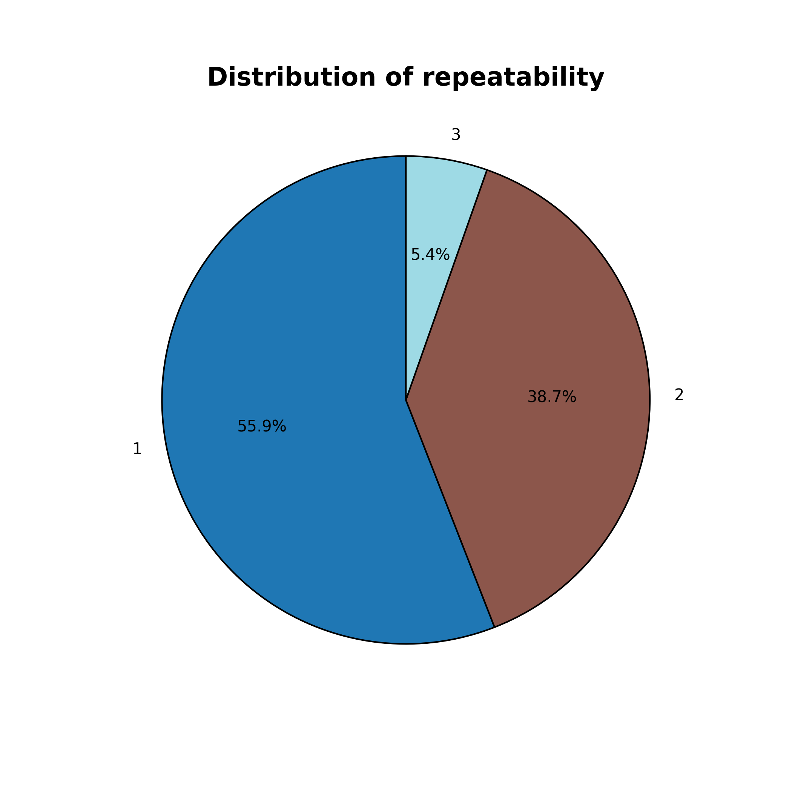
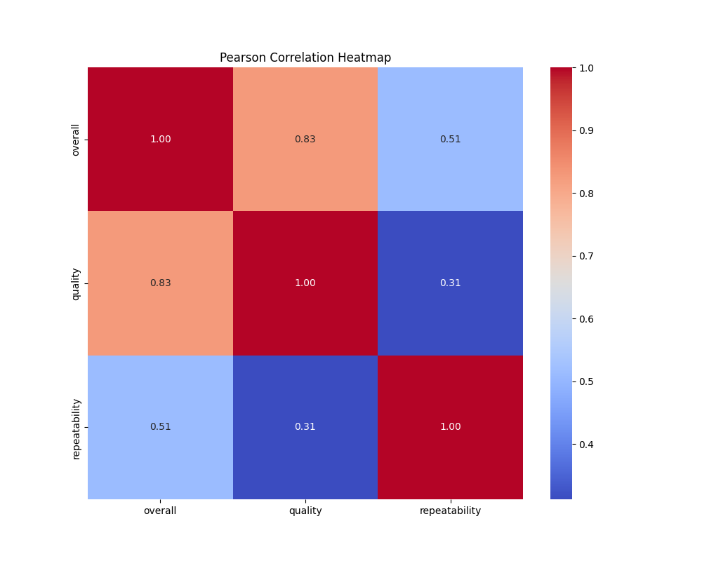

# Media Dataset Analysis Report

## Introduction

The **media.csv** dataset pertains to the **media sector**, specifically focusing on various media content ratings across different criteria. The dataset includes various media entries characterized by attributes such as date, language of content, type of media, title, author, and three numerical ratings: overall, quality, and repeatability. 

### Purpose and Role

This dataset is utilized primarily for the analysis of media content quality and audience engagement. It serves multiple purposes:

1. **Content Quality Assessment**: Evaluating the overall quality and consistency of various media types.
2. **Trend Analysis**: Understanding which languages and media types perform best over time.
3. **Clustering and Classification**: Identifying patterns and potential groupings within the data to enhance content strategy.

## Data Overview

### Data Structure
- **Shape**: The dataset contains **2652 rows** and **8 columns**, indicating a substantial amount of data for analysis.
- **Columns**:
  - `date` (Object): Represents the publication date.
  - `language` (Object): Language in which the media is published.
  - `type` (Object): Type/category of media.
  - `title` (Object): Title of the media content.
  - `by` (Object): Author or creator of the media.
  - `overall` (Integer): Overall rating of the media.
  - `quality` (Integer): Quality rating.
  - `repeatability` (Integer): Measure of the content's repeatability.

### Missing Values
- The dataset has **99 missing values** in the `date` column and **262 missing values** in the `by` column. Other columns have no missing values.

## Detailed Analysis

### 1. Data Inspection

- **Data Types Validation**: All columns were checked for an appropriate data type, confirming the validity of numerical and categorical distinctions.
- **Missing Values Handling**: No imputation was performed on numeric columns since they had no missing values.

### 2. Outlier Detection

Using techniques such as **Z-Score**, **IQR**, and **Isolation Forest**, notable outliers were detected:
- **Overall Ratings**: Identified 1216 outliers.
- **Quality Ratings**: Found 24 outliers.
- **Repeatability Ratings**: Detected 116 outliers.

### 3. Feature Engineering

Several new features were generated to enhance the data's analytical power:
- `overall_div_quality`: Ratio of overall to quality ratings.
- `overall_div_repeatability`: Ratio of overall to repeatability ratings.
- Additional features included ratios between quality and repeatability.

### 4. Dimensionality Reduction (PCA)

**Principal Component Analysis (PCA)** was employed to reduce the dimensions of the dataset to two components, capturing:
- **Explained Variance Ratio**: 
  - PCA1: 70.99%
  - PCA2: 24.23%

### 5. Clustering (KMeans)

KMeans clustering was applied to categorize the data into **three clusters**:
- **Cluster Center Coordinates**:
  - Cluster 1: [3.058, 3.107, 2.068]
  - Cluster 2: [4.123, 4.192, 1.902]
  - Cluster 3: [2.563, 2.822, 1.031]

### 6. Correlation Analysis

Using **Pearson correlation**, strong correlations were found:
- Overall and Quality: 0.83
- Overall and Repeatability: 0.51
- Quality and Repeatability: 0.31

## Visualizations

### 1. Distribution of Repeatability

This pie chart illustrates the distribution of repeatability ratings across various media entries, highlighting a predominant preference for certain repeatability levels.

### 2. Pareto Chart for Language

The Pareto chart shows the frequency and cumulative percentage of entries across different languages, indicating English as the most prevalent language, followed by Tamil and Telugu.

### 3. Pearson Correlation Heatmap

This heatmap provides a visual representation of the correlations among overall, quality, and repeatability ratings, significantly aiding in identifying relationships and areas for improvement.

## Summary and Conclusion

### Key Findings
- A substantial number of records indicate strong trends in media content by language, particularly favoring English.
- The data exhibits significant correlations, particularly between overall and quality ratings.
- Outlier detection revealed considerable variations in ratings that could warrant further investigation.

### Actionable Recommendations
1. **Address Missing Values**: Focus on acquiring or estimating the missing author names, as they play a crucial role in content creation analysis.
2. **Outlier Management**: Conduct a detailed review of outliers for quality assessment and potential content improvement strategies.
3. **Targeted Content Creation**: Based on language trends, prioritize content development in high-performing languages to maximize audience reach.

By leveraging the insights gained from this analysis, strategic decisions can be informed that enhance media quality and engagement effectively.